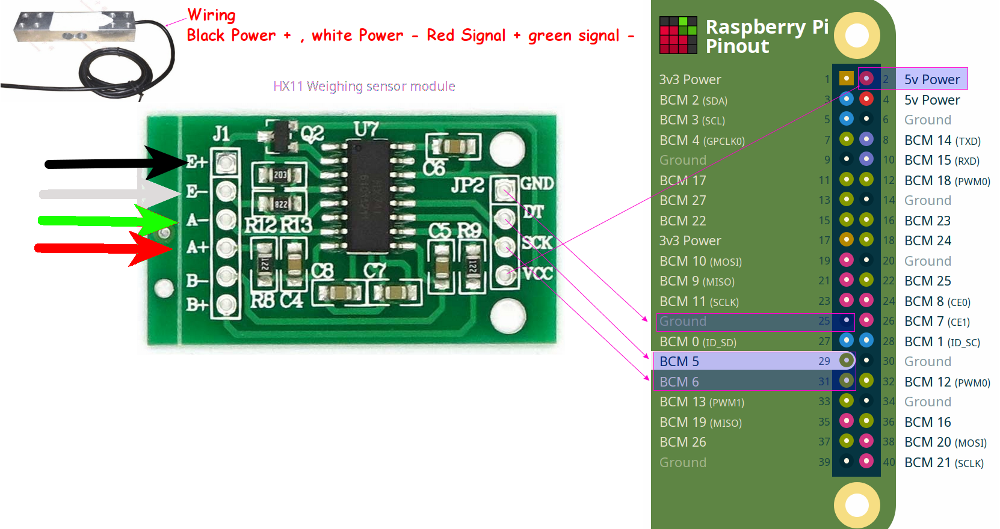

### Instructions
We recommend you to use ```Scale``` lib which removes spikes from measurements (```spikeless_example.py```).
However if you need raw data take a look at ```HX711``` lib (```example.py```).


#### Requirements
python >= 3.4

#### wiring example



----
### Info
Quick code credited to Philip Whitfield  "https://github.com/underdoeg/".
I've only made a few modifications on the way the captured bits are processed.

There is an improved version of underdoeg's one here: "https://gist.github.com/iilxy/f8b95cd039759b18edcdfe60684a6b8f"

##### Notice

This project was ported from https://github.com/tatobari/hx711py to work with python3 and added functions for my needs

------------
